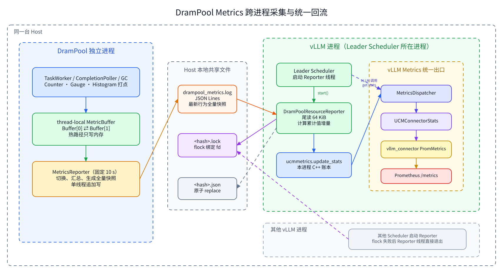
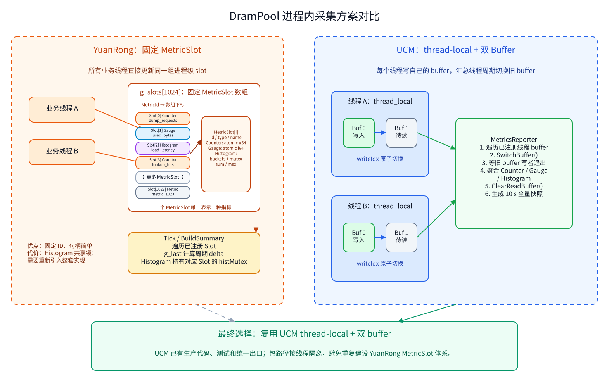

# DramPool Metrics 实现方案

## 1. 背景

DramPool 的整体部署架构由两个部分组成：

  1. DramStore 以动态链接库（SO）的形式集成于 vLLM 进程中，可直接复用 UCM 现有的 metrics 系统，仅需补充相应的指标定义与采集逻辑。

  2. 每台主机独立部署一个 DramPool 进程。由于 DramPool 与 vLLM 运行在不同的进程中，其内部采集的指标无法直接接入 vLLM 的
     metrics 系统。因此，采用与 YuanRong 一致的跨进程指标收集机制：DramPool 周期性地将指标快照写入本地文件，UCM 后台的 Reporter 线程读取最新快照，并将指标更新至 Scheduler 进程内的 ucmmetrics，最终通过现有的 vllm_connector 出口统一暴露。


## 2. 总体架构

> **整体设计**：跨进程链路参考 YuanRong；DramPool 进程内采集选择 UCM 已有的 **thread-local + 双 buffer** 实现，不重新实现 YuanRong 的全局 `MetricSlot` 体系。



可编辑源文件：[DramPool Metrics 跨进程架构图](./drampool_metrics_architecture_v2.excalidraw)。

```text
DramPool 业务线程
    │  Counter / Gauge / Histogram
    ▼
thread-local MetricBuffer（双 buffer）
    │  每 10 秒切换和汇总
    ▼
DramPool MetricsReporter
    │  追加一条全量 JSON 快照
    ▼
drampool_metrics.log
    │  Leader Scheduler 从文件尾部读取
    ▼
DramPoolResourceReporter
    │  累计值转增量
    ▼
ucmmetrics → MetricsDispatcher → vllm_connector → Prometheus
```

方案分成两段：

| 范围 | 组件 | 职责 |
| --- | --- | --- |
| DramPool 进程内 | `DramPoolMetrics` | 指标注册、业务线程打点、thread-local 双 buffer 管理 |
| DramPool 进程内 | `DramPoolMetricsReporter` | 每 10 秒汇总、维护累计值、写全量 JSON 快照 |
| Scheduler 进程内 | `DramPoolResourceReporter` | 抢占 host leader、读取最新快照、计算增量、回流 UCM |
| UCM 现有链路 | `ucmmetrics` / `MetricsDispatcher` | 汇总并通过 `vllm_connector` 输出 |


## 3. 进程内采集方案选型

候选方案包括 YuanRong 的固定 `MetricSlot` 和 UCM 的 thread-local 双 buffer。



可编辑源文件：[进程内采集方案对比图](./drampool_metrics_buffer_comparison_v2.excalidraw)。

### 3.1 YuanRong MetricSlot 实现

YuanRong 在进程内预分配固定大小的 slot 数组：

```cpp
constexpr size_t MAX_METRIC_NUM = 1024;
std::array<MetricSlot, MAX_METRIC_NUM> g_slots;
```

每个指标由固定 `id` 定位一个 `MetricSlot`。Slot 按 cache line 对齐，保存指标描述和运行值：

```cpp
struct alignas(64) MetricSlot {
    uint16_t id;
    MetricType type;
    std::string name;
    std::string suffix;

    std::atomic<uint64_t> u64Value;   // Counter 或 Histogram count
    std::atomic<int64_t> i64Value;    // Gauge
    std::atomic<uint64_t> sum;        // Histogram sum
    std::atomic<uint64_t> max;
    std::atomic<uint64_t> periodMax;
    HistBuckets histBuckets;
    std::mutex histMutex;
    bool used;
};
```

其工作方式如下：

| 类型 | 更新方式 | 汇总方式 |
| --- | --- | --- |
| Counter | `fetch_add()` 更新 `u64Value` | 读取累计值，与 `g_last` 做差得到周期增量 |
| Gauge | `fetch_add()` 或 `fetch_sub()` | 读取当前值，与上一次值比较 |
| Histogram | 持有 `histMutex` 后更新 count、sum、max 和 bucket | 持有同一把锁复制 bucket，并计算 p50/p90/p99 |

YuanRong MetricSlot 的加锁逻辑如下：

- `g_stateMutex` 用于防止并发生成快照，以及快照与初始化、重置同时执行。在当前单快照线程且只初始化一次的生产模型下，它主要是防御性保护。
- Counter/Gauge 使用原子变量，业务打点不加锁，也不受 `g_stateMutex` 影响。
- Histogram 使用每个 Slot 独立的 `histMutex`，保证 count、sum、max 和 buckets 的一致性。
- 快照读取 Histogram 时会短暂阻塞同一指标的写入，不同 Histogram 之间互不影响。

`Counter`、`Gauge` 和 `Histogram` 对外只是持有 `MetricSlot*` 的轻量句柄，业务调用不再执行名称查找。`Tick()` 到达监控周期后调用 `BuildSummary()`，扫描已注册 slot，用 `g_last` 保存的上一轮值计算 delta，最后输出 JSON Lines。

YuanRong 的 `ScopedTimer` 同样是一个轻量 RAII 对象：构造时保存 `steady_clock::now()`，析构时将微秒耗时写入对应 Histogram slot。

这种方案结构紧凑，固定 ID 的访问成本低。不过所有线程会直接更新同一组 slot；尤其 Histogram 更新需要竞争 slot 内的互斥锁。若用于 DramPool，还需要重新引入 slot 注册、全局数组、周期快照和输出等整套逻辑。

### 3.2 UCM thread-local + 双 buffer 实现

UCM 已经提供完整的 `MetricBuffer`、线程注册、读写切换和多线程聚合实现。每个打点线程拥有自己的 `thread_local MetricBuffer`，不同业务线程不会更新同一个 map。

每个 `MetricBuffer` 包含两个 `InnerBuffer`：

```cpp
struct MetricBuffer {
    struct InnerBuffer {
        std::unordered_map<MetricId, double> counterStats;
        std::unordered_map<MetricId, double> gaugeStats;
        std::unordered_map<MetricId, HistogramStat> histogramStats;
    };

    InnerBuffer innerBufs[2];
    std::atomic<int> writeIdx{0};
    std::atomic<int> activeWriteIdx{-1};
};
```

两层隔离降低了热路径竞争：

1. **线程之间隔离**：TaskWorker、CompletionPoller、Receiver 和 GC 线程分别写自己的 thread-local buffer。
2. **采集与写入隔离**：同一线程的两个 InnerBuffer 轮换使用，业务线程写新 buffer 时，Reporter 汇总旧 buffer。


## 4. DramPool 进程侧处理

### 4.1 线程首次注册

每个业务线程首次调用 `UpdateStats()` 时，将自己的 thread-local buffer 注册到 `DramPoolMetrics`，后续打点直接写入当前 write buffer。已注册 buffer 保留到 `DramPoolServer` 停止。

```text
UpdateStats(metric, value)
    │
    ├─ 已注册 ──────────────┐
    │                              │
    └─ 未注册：加入 buffers 列表 │
                                   ▼
                           写入 write buffer
```

### 4.2 耗时指标打点

同步阶段使用 `ScopedTimer` 通过 RAII 记录耗时：

```cpp
Status MetadataManager::StoreBegin(...)
{
    ScopedTimer timer(metrics_, MetricId::STORE_BEGIN_DURATION);
    // 原有 StoreBegin 逻辑
}
```

构造时记录单调时钟，析构时将微秒耗时写入 Histogram。

### 4.3 双 Buffer 周期采集

每 10 秒，`DramPoolMetricsReporter` 对每个已注册 buffer 执行：

```text
业务线程                               Reporter
   │                                     │
   │  持续写 Buffer[0]                    │ exchange writeIdx: 0 → 1
   │  下一次打点开始写 Buffer[1]          │ wait activeWriteIdx != 0
   │  持续写 Buffer[1]                    │ 汇总并清空 Buffer[0]
   ▼                                     ▼
```

1. `SwitchBuffer()` 原子切换 `writeIdx` 并返回旧索引。
2. `WaitNoActiveWriter(oldIdx)` 等待切换瞬间已进入旧 buffer 的单次写入结束。
3. Reporter 汇总旧 buffer，然后将其清空供后续周期复用。

业务线程在切换后继续写新 buffer，不需要等待 Reporter 完成汇总。

### 4.4 JSON Lines 格式

Metrics 文件位于 `${g_config.logDir}/drampool_metrics.log`，每行是一个完整的 `resource_snapshot` JSON：

```json
{
  "time": "2026-09-03T12:00:00+08:00",
  "event": "resource_snapshot",
  "version": "v0",
  "metrics": {
    "request_count": {
      "dump_requests_total": 1200,
      "load_requests_total": 860
    },
    "memory": {
      "used_bytes": 68719476736,
      "total_bytes": 137438953472
    },
    "load_duration": {
      "count": 860,
      "sum_us": 92450,
      "bucket_counts": [12, 36, 812]
    }
  }
}
```

该格式使用顶层 `time/event/version/metrics`，指标在 `metrics` 中按资源组组织。Reporter 构造完整 JSON 和换行符后提交给 `MetricsFlush` 线程，由后者以 append 模式单线程写入文件。

### 4.5 Reporter 维护累计快照

双 buffer 汇总得到的是最近 10 秒的增量。Reporter 将 Counter 和 Histogram 合并到进程级累计值，Gauge 保留当前值：

```text
cumulative_counter += interval_counter
cumulative_histogram.bucket[i] += interval_histogram.bucket[i]
cumulative_histogram.sum += interval_histogram.sum
current_gauge = sample_current_value()
```

因此，`drampool_metrics.log` 的每一行都是独立的终点状态，vLLM 侧只需读取最新完整行。文件采用按大小轮转，避免无限增长：

```text
周期生成资源快照
        ↓
后台 MetricsFlush 线程追加到 drampool_metrics.log
        ↓
文件达到 max_log_size
        ↓
旧文件重命名为 drampool_metrics.<时间戳>.log
        ↓
重新创建空的 drampool_metrics.log
        ↓
超过 max_log_file_num 时删除最旧的轮转文件
```

## 5. vLLM 侧处理

### 5.1 Reporter 启动与 Leader 选择

Scheduler 初始化 DramStore 时启动 `start_drampool_resource_reporter(config)`。同一 host 上的多个 Scheduler 使用 `endpoint + log_path` 的哈希构造 lock 和 state 文件名：

```python
identity = sha256(f"{endpoint}|{Path(log_path).resolve()}".encode()).hexdigest()[:24]
lock_path = shared_dir / f"ucm_drampool_metrics_{identity}.lock"
state_path = shared_dir / f"ucm_drampool_metrics_{identity}.json"
```

Reporter 启动时只尝试一次 `flock(LOCK_EX | LOCK_NB)`。成功者持有 fd 并负责回流；失败者关闭 fd 并退出线程，运行期间不重新选择 Leader。

### 5.2 读取最新完整快照

```text
open(log_path, "rb")
    → seek(EOF)
    → 从尾部向前读取 64 KiB
    → 忽略末尾可能存在的半行
    → 选择最新完整 JSON
```

单条快照通常小于 64 KiB，正常情况一次读取即可命中，读取成本不随日志文件增长。

### 5.3 累计快照转换为本轮增量

Counter 以及 Histogram 的 count、sum 和 bucket count 按以下规则计算增量，Gauge 直接使用最新值：

```python
delta = current - previous if current >= previous else current
```

`current < previous` 表示 DramPool 重启或指标 reset。Leader 在回流成功后将当前累计值写入 `ucm_drampool_metrics_<hash>.json`：

```text
写 .<pid>.tmp
    → 关闭完整临时文件
    → os.replace(tmp_path, state_path)
```

`os.replace()` 保证 state 文件只有新、旧两种完整状态。处理顺序为“先回流、后更新 state”，语义上优先避免指标丢失。

### 5.4 回流 UCM 统一出口

```python
updates = counter_deltas | gauges
ucmmetrics.update_stats(updates)
```

数据随后进入 Scheduler/EngineCore 进程内的 C++ metrics 单例，由现有 `MetricsDispatcher` 分发到 `vllm_connector`。Histogram 的 bucket 增量通过 metrics binding 的批量 Histogram 接口写入，不逐条重放 observation。

## 6. 核心异常处理

Metrics 是旁路能力。文件写入、解析或回流失败时记录告警并等待下一轮，不能阻塞或终止 DUMP、LOAD、LOOKUP 主流程。

| 异常 | 处理方式 |
| --- | --- |
| metrics 文件不存在或为空 | 本轮记录 warning，等待下一轮 |
| 文件末尾为半行 | 忽略半行，读取上一条完整记录 |
| JSON 解析失败 | 本轮不更新 state，等待下一轮 |
| state 文件不存在 | 将当前累计值作为 baseline，避免首次启动回灌全部历史值 |
| state 文件损坏 | 记录 warning，按无 state 处理 |
| Leader Scheduler 退出 | fd 随进程关闭并释放文件锁；当前推理实例不再回流节点指标 |
| DramPool Counter reset | `delta=current`，不产生负数 |
| 文件写入失败 | 记录错误，DramPool 业务继续运行 |
